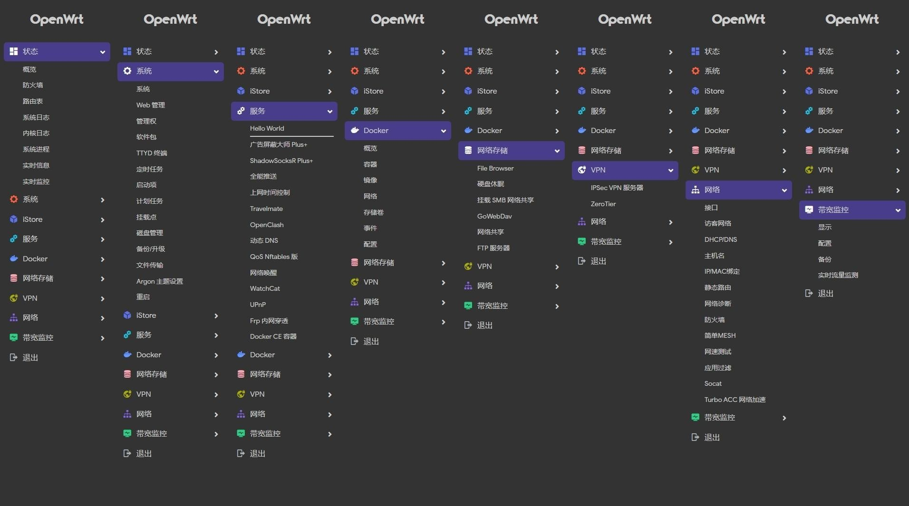

# OpenWrt_Build

## Note

A actions for building OpenWrt with GitHub Actions  

Web admin panel default IP is 192.168.2.1 and default password is "password".  

## Preview
  

## Credits
- [OpenWrt](https://github.com/openwrt/openwrt)
- [Lean's OpenWrt](https://github.com/coolsnowwolf/lede)
- [P3TERX's Actions](https://github.com/P3TERX/Actions-OpenWrt)
- [SuLingGG's Actions](https://github.com/SuLingGG/OpenWrt-Rpi)
