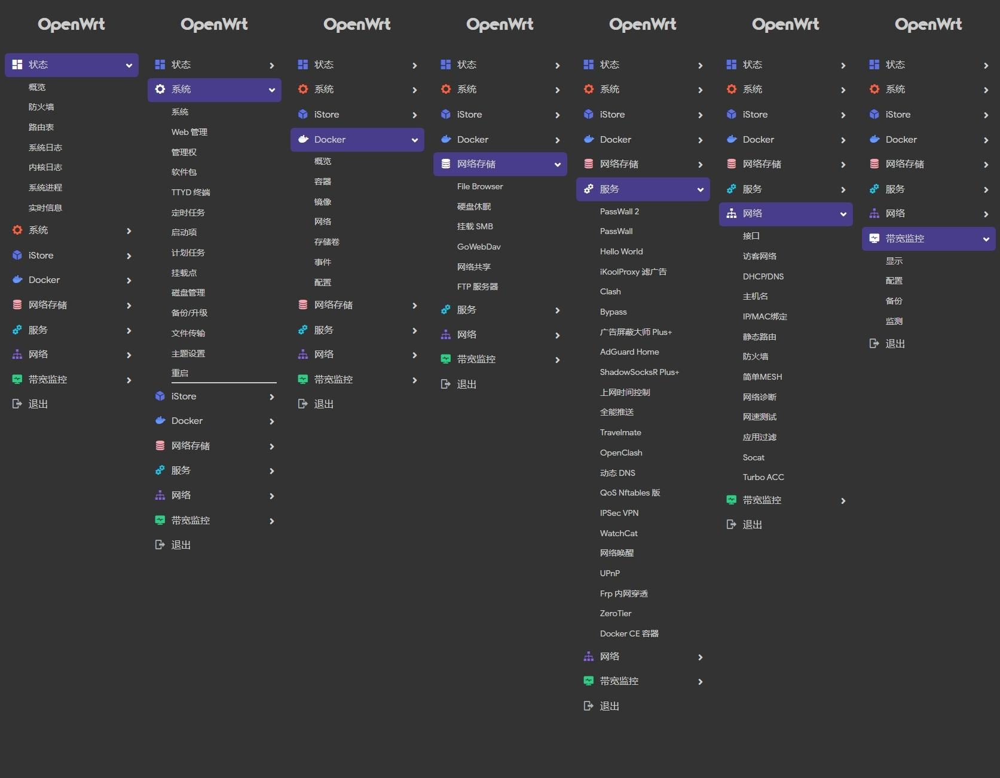

# OpenWrt_Build

## 介绍  
[OpenWrt_Build](https://github.com/wjz304/OpenWrt_Build)

<!-- version -->

<!-- license -->

## Note

既然没有想要的功能，那就自己编吧！

Web admin panel default IP is 192.168.2.1 and default password is "password".  

## Preview
  

## Credits
- [OpenWrt](https://github.com/openwrt/openwrt)
- [Lean's OpenWrt](https://github.com/coolsnowwolf/lede)
- [P3TERX's Actions](https://github.com/P3TERX/Actions-OpenWrt)
- [SuLingGG's Actions](https://github.com/SuLingGG/OpenWrt-Rpi)

# log
2022/11/09:  
Add WiFi  
CONFIG_PACKAGE_r8152-firmware=y  
CONFIG_PACKAGE_kmod-crypto-gcm=y  
CONFIG_PACKAGE_kmod-crypto-gf128=y  
CONFIG_PACKAGE_kmod-crypto-ghash=y  
CONFIG_PACKAGE_kmod-usb-net-cdc-ether=y  
CONFIG_PACKAGE_kmod-usb-net-cdc-ncm=y  
CONFIG_PACKAGE_kmod-usb-net-rtl8152=y  
CONFIG_PACKAGE_kmod-usb-net-rtl8152-vendor=m  
CONFIG_PACKAGE_kmod-mac80211=y  
CONFIG_PACKAGE_MAC80211_DEBUGFS=y  
# CONFIG_PACKAGE_MAC80211_TRACING is not set  
CONFIG_PACKAGE_MAC80211_MESH=y  
CONFIG_PACKAGE_kmod-mt76-connac=y  
CONFIG_PACKAGE_kmod-mt76-core=y  
CONFIG_PACKAGE_kmod-mt76-sdio=y  
CONFIG_PACKAGE_kmod-mt76-usb=y  
CONFIG_PACKAGE_kmod-mt7921-common=y  
CONFIG_PACKAGE_kmod-mt7921e=y  
CONFIG_PACKAGE_kmod-mt7921s=y  
CONFIG_PACKAGE_kmod-mt7921u=y  
CONFIG_PACKAGE_libpcap=m  
CONFIG_PACKAGE_libubox-lua=m  
CONFIG_PACKAGE_dynapoint=m  
CONFIG_PACKAGE_hcxdumptool=m  
CONFIG_PACKAGE_hcxtools=m  
CONFIG_PACKAGE_horst=m  
CONFIG_DRIVER_11N_SUPPORT=y  
CONFIG_DRIVER_11AC_SUPPORT=y  
CONFIG_DRIVER_11AX_SUPPORT=y  
